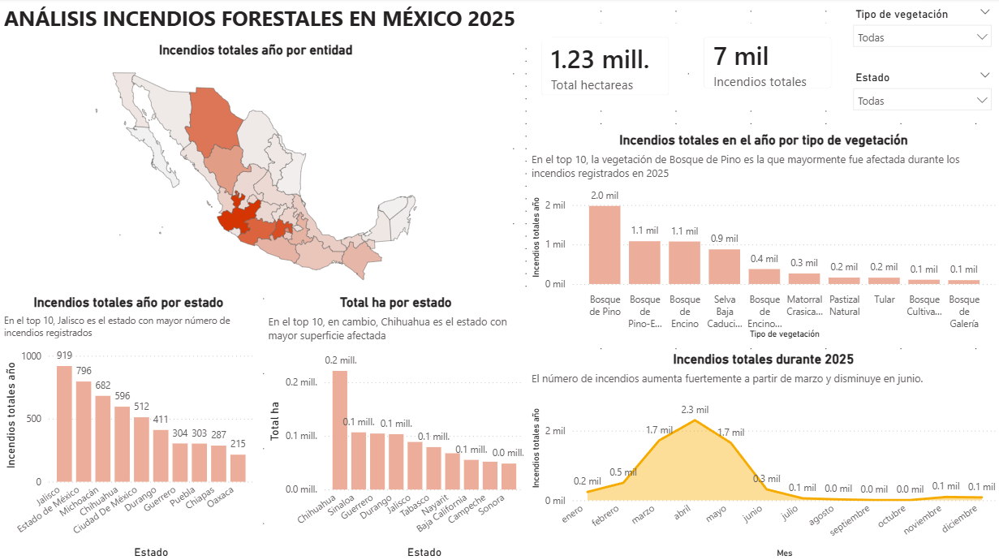

# Análisis de incendios forestales en México (2025)

Análisis de los incendios forestales registrados por la Comisión Nacional Forestal (CONAFOR) durante 2025, combinando limpieza y análisis exploratorio en Python con visualización interactiva en Power BI.

## Introducción

Los incendios forestales no son solo un dato más: son un fenómeno que impacta directamente ecosistemas, biodiversidad y comunidades. Cuando CONAFOR publicó el registro oficial de incendios forestales de 2025, quise responder una pregunta concreta: **¿qué estados concentran mayor impacto, qué tipo de vegetación es más vulnerable, y qué está causando realmente estos incendios?**

Trabajé el dataset (7,016 registros, 76 variables) en dos etapas: primero en Python (Google Colab), donde limpié y validé la información —fechas, duplicados, consistencia de categorías— y después en Power BI, donde construí un dashboard interactivo para explorar los hallazgos por estado, tipo de vegetación, causa y evolución a lo largo del año.

## Pregunta de negocio

¿Qué estados, tipos de vegetación y causas concentran el mayor impacto de los incendios forestales en México, y qué factores están asociados a los incendios más destructivos?

## Fuente de datos

- **Origen:** Comisión Nacional Forestal (CONAFOR), registro oficial de incendios forestales 2025.
- **Tamaño:** 7,016 registros, 76 variables.
- **Variables clave utilizadas:** entidad, municipio, fecha de inicio y liquidación, tipo de vegetación, posible causa, superficie afectada (hectáreas), duración del incendio.

## Metodología

1. **Carga y exploración inicial** — inspección de estructura, tipos de datos y consistencia general.
2. **Limpieza de datos** — validación de duplicados, conversión de fechas a formato datetime, verificación de valores inválidos.
3. **Análisis exploratorio en Python** — distribución de incendios por estado, superficie afectada, causas, tipo de vegetación y relación entre duración y superficie afectada.
4. **Exportación** de los datos limpios para su uso en Power BI.
5. **Visualización interactiva en Power BI** — dashboard con KPIs, mapa por estado, series de tiempo y segmentación por tipo de vegetación.

## Herramientas

- **Python** (pandas, seaborn, matplotlib) — limpieza y análisis exploratorio
- **Google Colab** — entorno de desarrollo
- **Power BI** — visualización interactiva y dashboard final

## Hallazgos principales

- Se registraron **7,016 incendios** en México durante 2025, con una superficie total afectada de **1,230,212 hectáreas**.
- **Jalisco** concentra el mayor número de incendios (919), seguido de México (796) y Michoacán (682). Sin embargo, **Chihuahua** es el estado con mayor superficie afectada, lo que indica incendios menos frecuentes pero significativamente más destructivos en promedio.
- El tipo de vegetación más afectado fue **Bosque de Pino** (1,978 registros), seguido de Bosque de Pino-Encino y Bosque de Encino.
- De los incendios con causa identificada, las **actividades agrícolas** (1,539) y las causas **intencionales** (1,337) dominan por mucho sobre las causas naturales (95 registros) — la mayoría de los incendios forestales en México en 2025 son de origen antropogénico, no natural.
- Los incendios con duración **mayor a 7 días** representan solo el **7%** del total, pero concentran el **58%** de toda la superficie afectada, con un promedio de **1,480 hectáreas** por incendio frente a apenas **18 hectáreas** en los que se resuelven en un solo día. Esto sugiere que la velocidad de respuesta y contención inicial es un factor crítico para limitar el impacto real de un incendio.

## Estructura del repositorio

```
├── README.md
├── analisis_incendios_2025.ipynb   # Notebook de Python (Google Colab)
├── incendios_2025_limpio.csv       # Dataset limpio, listo para Power BI
├── incendios_2025.pbix             # Dashboard de Power BI
└── dashboard_preview.png           # Captura del dashboard
```

## Dashboard



## Cómo reproducir el análisis

1. Clona el repositorio: `git clone https://github.com/carlosarg92/analisis-incendios-forestales-mexico-2025.git`
2. Abre `analisis_incendios_2025.ipynb` en Google Colab o Jupyter.
3. Ejecuta las celdas en orden; el notebook exporta el dataset limpio a `incendios_2025_limpio.csv`.
4. Abre `incendios_2025.pbix` en Power BI Desktop para explorar el dashboard interactivo.

## Autor

**Carlos Martín Ascencio Robles Gil**
Biólogo en transición hacia análisis de datos
[LinkedIn](https://www.linkedin.com/in/carlos-mart%C3%ADn-ascencio-robles-gil-990b02166) · [Portafolio en Notion](https://app.notion.com/p/Portafolio-f1b92614f0618307b3e6013ac6643c09)
